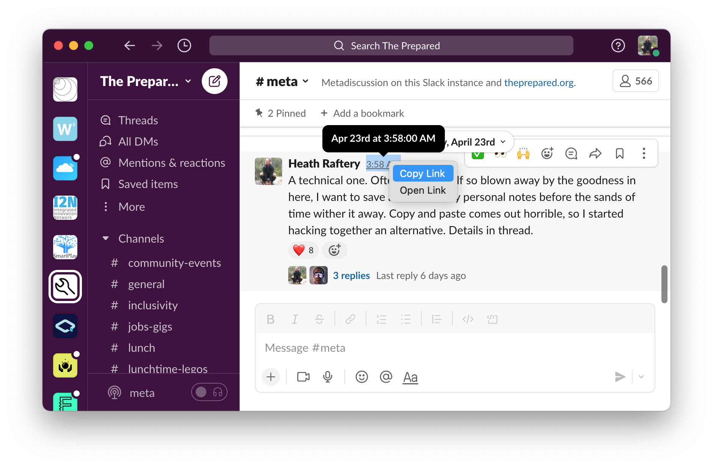
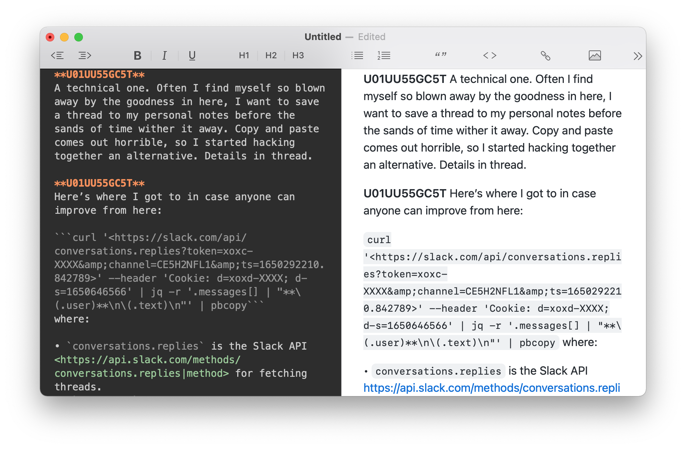

# SlackClipper
Copy the contents of a Slack thread.

---

# Description

Great conversations happen in Slack. But once the conversation is over, how do you use what you've learned? You could rely on your memory, so your precious insights are as easy to find as your car keys. Or you could extract the content and store it in your favourite knowledge-management system, like Notion, Confluence, Obsidian or JIRA.

Unfortunately, when it comes to sharing data, Slack is pretty stubborn. Simply highlighting the text of a thread and copying it results in mostly garbage. If all your Slack administrators are similarly motivated, they might have installed third-party apps that tie into a corporate workflow.

So what if you just want the text of a Slack thread your way? You need `slackclipper`.

`slackclipper` uses your personal Slack account to copy the text you want in the format you prefer. Want to add a discussion to a JIRA issue? Store some golden knowledge in Obsidian? Reference some colleagues in your Notion? `slackclipper` enables it all. Simply provide it the thread you want to clip and it will return the content, formatted ready for its new life.

By default the clipped content will be neatly formatted in Markdown. But the data is yours! Customise the format, or even export to any format with an API. Prefer PDF, or Google Docs or even dictated audio? Go for it!

***This project is not endorsed or authorised in any way by Slack Technologies LLC.***

# Installation

**Note:** requires Python 3.11 or earlier! This is a limitation of the `leveldb` package, which is used by the `slacktokens` dependency. The restriction is now enforced by the packaging, but pip and friends provide confusing error messages like "these package versions have conflicting dependencies.

With a compatible version of Python installed, just run:

    pip install slackclipper

This will install the `slackclipper` library for advanced use within Python, but also installs a convenience executable by the same name, so you can run it directly from the command line.

# Usage

1. Copy the link to the thread in Slack.

2. Run `slackclipper` in your Terminal.

3. Paste the result into the destination of your choice.


## Extracting Slack Credentials

When `slackclipper` is run for the first time, it will attempt to extract your Slack credentials using `slacktokens`. You may be prompted for your password.

If extraction is successful, these credentials will be stored (in `~/.config/slackclipper/`) for future use. To replace the store with freshly extracted credentials, run `slackclipper` with the `-u` or `-update-credentials` flag.

## Support for non-App Store Slack on MacOS

Support for when Slack is directly downloaded and installed, instead of installed through the Mac App Store, is broken in the current release version of the dependency `pycookiecheat`. However the fix has been merged into the repository. To apply it, you can do something like:

```
# Download the current version of the source file
curl -L https://raw.githubusercontent.com/n8henrie/pycookiecheat/refs/heads/master/src/pycookiecheat/chrome.py -o chrome.py

# Get the location of the pycookiecheat package on your computer
# Replace `python3` with the python you used to install slackclipper. Eg `python3.11`.
PACKAGE_PATH=$(python3 -c "import pycookiecheat, os; print(os.path.dirname(pycookiecheat.__file__))")

# Dry run to make sure the replacement is good. You should see a diff like that in the commit:
# https://github.com/n8henrie/pycookiecheat/commit/36f72082e9a6a77cf84c5000150e7f779d73b14d
diff chrome.py "$PACKAGE_PATH/chrome.py"

# Do the replacement
mv chrome.py "$PACKAGE_PATH/chrome.py"
```

---


# Shortcomings

- `slackclipper` relies on `slacktokens` to extract your Slack credentials. `slacktokens` currently only supports macOS and Linux.
	- If credentials extraction fails for this or any other reason, credentials can be provided manually using Python like so:

		```python
		>>> from slackclipper import update_credentials_store
		>>> update_credentials_store(creds) # where "creds" is in the format produced by slacktokens
		```
- Timestamps are not yet included in the output. Just need to come up with a suitable format.
- Some things aren't formatted well. For example:
	- links are oddly formatted;
	- mentions and emoticons aren’t;
	- and multimedia won’t come through well.
- Only exports in MarkDown format for now.
